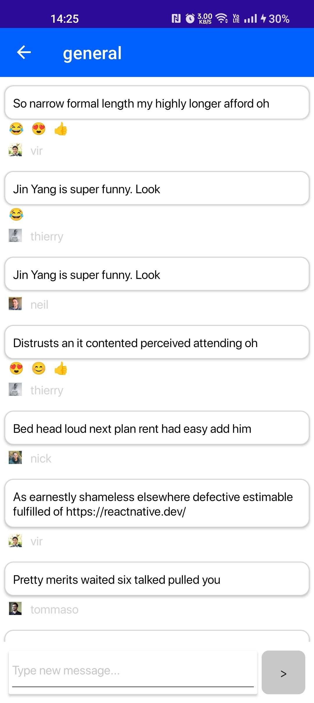

# Example of a .NET MAUI Chat Messaging App using Stream Chat SDK
Example of using [Stream Chat SDK](https://getstream.io/chat/docs/unity/?language=unity) in a .NET MAUI application.

### Presented features:
1. Connect to the Stream Chat Server
2. Query channels
3. Show channel messages
4. Send new messages
5. Send/Delete reactions
6. Show the user's reactions
7. Delete a message
8. Loading older messages when scrolling to the top of the messages list

## How to run this project?
1. Create a [Stream Account](https://getstream.io/try-for-free/) and start a trial
2. Go to [Stream's Dashboard](https://dashboard.getstream.io/) and:
    1. Create a new app
    2. [Enable Developer Tokens](https://getstream.io/chat/docs/unity/tokens_and_authentication/?language=unity#developer-tokens) (Authorization will not work in this example otherwise!)
    3. Take the `Api Key` of your App and save it in the [StreamApiKey field of the StaticConfig](https://github.com/sierpinskid/stream-chat-dotnet-maui/blob/main/StreamChatMaui/StaticConfig.cs) (please note that `api key` is different from `api secret`)
3. Run the application

## Documentation
If you wish to futher explore the SDK features, please refer to our [Unity/C# Docs](https://getstream.io/chat/docs/unity/?language=unity). All code examples from the Unity docs will work in a .NET MAUI application. Please note that our [.NET/C# Docs](https://getstream.io/chat/docs/dotnet-csharp/?language=csharp) refer to a *Backend* SDK and will not work with .NET MAUI.

## Stream Chat Service
The key component that initiates a connection with the Stream Chat Server is the [Stream Chat Service](https://github.com/sierpinskid/stream-chat-dotnet-maui/blob/main/StreamChatMaui/Services/StreamChatService.cs). There are three actions required throughout a single session of the app running:
1. Initiate the connection with `streamClient.ConnectUserAsync(credentials);`
2. Call `streamClient.Dispose()` when finished using to free up resources

All of the above is handled by the [Stream Chat Service](https://github.com/sierpinskid/stream-chat-dotnet-maui/blob/main/StreamChatMaui/Services/StreamChatService.cs).

## Screenshots

  
  
  
  

### Tested on:
- Windows
- Mac Catalyst
- Android Emulator
- Android Device

### Steps taken to create this project
1. Create a new .NET MAUI project
2. Add [Newtonsoft.Json](https://www.nuget.org/packages/Newtonsoft.Json/) package
3. Add Stream Chat SDK
4. Add [MAUI Community Toolkit](https://learn.microsoft.com/en-us/dotnet/communitytoolkit/maui/get-started?tabs=CommunityToolkitMaui)

### Conventions
Each class members are sorted:
- by accessibility modifier: public -> protected -> private
- then by member type: properties -> fields -> methods

## Interested in a Stream Chat SDK for .NET MAUI?
Please contact our [Support](https://getstream.io/contact/support/) if you'd wish to receive the latest Stream Chat SDK for .NET MAUI
